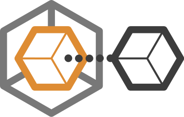

# Proxy Manager

This library aims at providing abstraction for generating various kinds of [proxy classes](http://marco-pivetta.com/proxy-pattern-in-php/).



[](https://travis-ci.org/Ocramius/ProxyManager)
[](https://scrutinizer-ci.com/g/Ocramius/ProxyManager/)
[](https://scrutinizer-ci.com/g/Ocramius/ProxyManager/)
[](https://insight.sensiolabs.com/projects/69fe5f97-b1c8-4ddd-93ce-900b8b788cf2)
[](https://www.versioneye.com/package/php--ocramius--proxy-manager)

[](https://packagist.org/packages/ocramius/proxy-manager)
[](https://packagist.org/packages/ocramius/proxy-manager)
[](https://packagist.org/packages/ocramius/proxy-manager)

## Installation

The suggested installation method is via [composer](https://getcomposer.org/):

```sh
php composer.phar require ocramius/proxy-manager:0.5.*
```

## Lazy Loading Value Holders (Virtual Proxy)

ProxyManager can generate [lazy loading value holders](http://www.martinfowler.com/eaaCatalog/lazyLoad.html),
which are virtual proxies capable of saving performance and memory for objects that require a lot of dependencies or
CPU cycles to be loaded: particularly useful when you may not always need the object, but are constructing it anyways.

```php
$factory = new \ProxyManager\Factory\LazyLoadingValueHolderFactory();

$proxy = $factory->createProxy(
    'MyApp\HeavyComplexObject',
    function (& $wrappedObject, $proxy, $method, $parameters, & $initializer) {
        $wrappedObject = new HeavyComplexObject(); // instantiation logic here
        $initializer   = null; // turning off further lazy initialization
    
        return true;
    }
);

$proxy->doFoo();
```

See the [complete documentation about lazy loading value holders](/docs/lazy-loading-value-holder.md)
in the `docs/` directory.

## Access Interceptor Value Holder

An access interceptor value holder is a smart reference that allows you to execute logic before
and after a particular method is executed or a particular property is accessed, and it allows to
manipulate parameters and return values depending on your needs.

```php
$factory = new \ProxyManager\Factory\AccessInterceptorValueHolderFactory();

$proxy = $factory->createProxy(
    new \My\Db\Connection(),
    array('query' => function () { echo "Query being executed!\n"; }),
    array('query' => function () { echo "Query completed!\n"; })
);

$proxy->query(); // produces "Query being executed!\nQuery completed!\n"
```

See the [complete documentation about access interceptor value holders](/docs/access-interceptor-value-holder.md)
in the `docs/` directory.

## Access Interceptor Scope Localizer

An access interceptor scope localizer works exactly like an access interceptor value holder,
but it is safe to use to proxy fluent interfaces.

See the [complete documentation about access interceptor scope localizer](/docs/access-interceptor-scope-localizer.md)
in the `docs/` directory.

## Null Objects

A Null Object proxy implements the [null object pattern](http://en.wikipedia.org/wiki/Null_Object_pattern).

This kind of proxy allows you to have fallback logic in case loading of the wrapped value failed.

```php
$factory = new \ProxyManager\Factory\NullObjectFactory();

$proxy = $factory->createProxy('My\EntityObject');

$proxy->getName(); // empty return
```

A Null Object Proxy can be created from an object, a class name or an interface name:

```php
$factory = new \ProxyManager\Factory\NullObjectFactory();

$proxy = $factory->createProxy('My\EntityObjectInterface'); // created from interface name
$proxy->getName(); // empty return

$proxy = $factory->createProxy($entity); // created from object
$proxy->getName(); // empty return
```

See the [complete documentation about null object proxy](/docs/null-object.md)
in the `docs/` directory.

## Ghost Objects


Similar to value holder, a ghost object is usually created to handle lazy loading.

The difference between a value holder and a ghost object is that the ghost object does not contain a real instance of
the required object, but handles lazy loading by initializing its own inherited properties.

ProxyManager can generate [lazy loading ghost objects](http://www.martinfowler.com/eaaCatalog/lazyLoad.html),
which are proxies used to save performance and memory for large datasets and graphs representing relational data.
Ghost objects are particularly useful when building data-mappers.

Additionally, the overhead introduced by ghost objects is very low when compared to the memory and performance overhead
caused by virtual proxies.

```php
$factory = new \ProxyManager\Factory\LazyLoadingGhostFactory();

$proxy = $factory->createProxy(
    'MyApp\HeavyComplexObject',
    function ($proxy, $method, $parameters, & $initializer) {
        $initializer   = null; // turning off further lazy initialization

        // modify the proxy instance
        $proxy->setFoo('foo');
        $proxy->setBar('bar');

        return true;
    }
);

$proxy->doFoo();
```

See the [complete documentation about lazy loading ghost objects](/docs/lazy-loading-ghost-object.md)
in the `docs/` directory.

## Lazy References

A lazy reference proxy is actually a proxy backed by some kind of reference holder (usually a registry) that can fetch
existing instances of a particular object.

A lazy reference is usually necessary when multiple instances of the same object can be avoided, or when the instances
are not hard links (like with [Weakref](http://php.net/manual/en/book.weakref.php)), and could be garbage-collected to
save memory in long time running processes.

This feature [yet to be planned](https://github.com/Ocramius/ProxyManager/issues/8).

## Remote Object

A remote object proxy is an object that is located on a different system, but is used as if it was available locally.
There's various possible remote proxy implementations, which could be based on xmlrpc/jsonrpc/soap/dnode/etc.

This example uses the XML-RPC client of Zend Framework 2:

```php
interface FooServiceInterface
{
    public function foo();
}

$factory = new \ProxyManager\Factory\RemoteObjectFactory(
    new \ProxyManager\Factory\RemoteObject\Adapter\XmlRpc(
        new \Zend\XmlRpc\Client('https://example.com/rpc-endpoint')
    )
);

// proxy is your remote implementation
$proxy = $factory->createProxy('FooServiceInterface');

var_dump($proxy->foo());
```

See the [complete documentation about remote objects](https://github.com/Ocramius/ProxyManager/tree/master/docs/remote-object.md)
in the `docs/` directory.

## Contributing

Please read the [CONTRIBUTING.md](https://github.com/Ocramius/ProxyManager/blob/master/CONTRIBUTING.md) contents if you
wish to help out!

## Credits

The idea was originated by a [talk about Proxies in PHP OOP](http://marco-pivetta.com/proxy-pattern-in-php/) that I gave
at the [@phpugffm](https://twitter.com/phpugffm) in January 2013.

